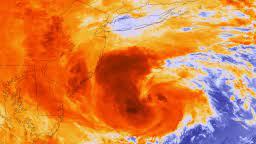
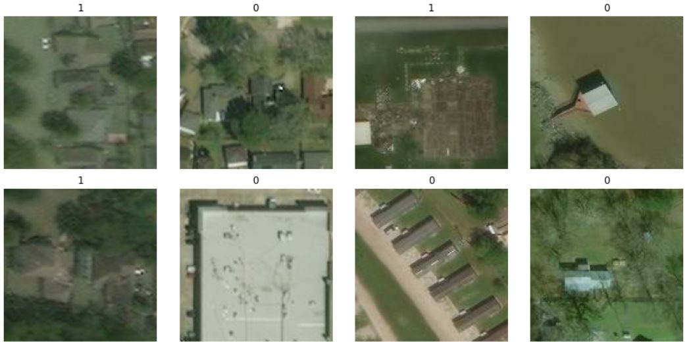
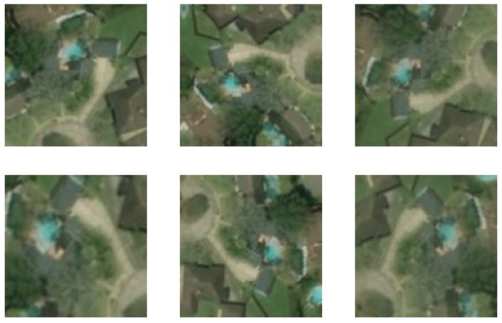
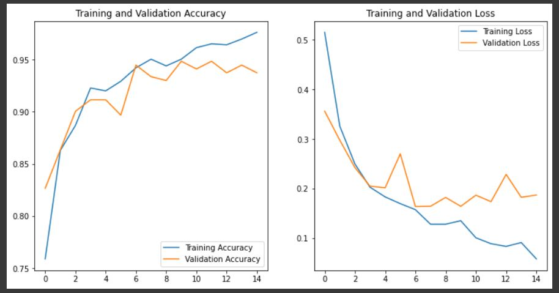

# Train Deep Learning model as Hurricane Satellite Images Damage Detector

## Motivation,

Hurricane is one of the most disastrous natural disasters causing immense harm to the ecosystem and economic system worldwide. It is also known as a tropical cyclone. Heavy rainfall and high winds accompanying hurricane inflict damage to property as well as loss of human life. Hence, appropriate steps need to be taken to mitigate the damage caused by the disaster.

Satellite imagery is being used for damage detection due to its ability to cover large spatial and temporal areas. But manual damage detection is error prone. Therefore, machine learning and deep learning which automated methods are used for detection of damage. This analysis includes the use of machine learning and deep learning for detection of damage caused by natural disasters with a special focus on hurricane damage.

## Model used
- Based model: constructing **Conv model from scratch** to be used as base model for general comparison
- **VGG16** as second mode, will be used as base model for pre-trained model comparison
- Final prediction and tuning is done on **ResNet50**
Here is an example of including images:

## Picture sample before preprocessing:

Eventually I had to enhance pictures quality. for repeatability, I utilized augmentation as part of model preprocessing.
for more information visit Keras [Docmentation](https://keras.io/api/layers/preprocessing_layers/image_augmentation/random_flip/)

# Picture sample After preprocessing:

for preprocessing, I used horizental and vertical fliping. And keras randomContrast

## Model results:

it is promising, acheiving 93.73% validation accuracy while maintening smooth error curve

## Next step:

- Train for more epochs (here we used 15 for lack of times)
- Test using Keras_tuner for hyperparameter tunning
  - Testing different optimizers
  - Vary learning rate

# References

- [Original_paper](https://arxiv.org/abs/1807.01688)
- [Main_data_images](https://ieee-dataport.org/open-access/detecting-damaged-buildings-post-hurricane-satellite-imagery-based-customized)
